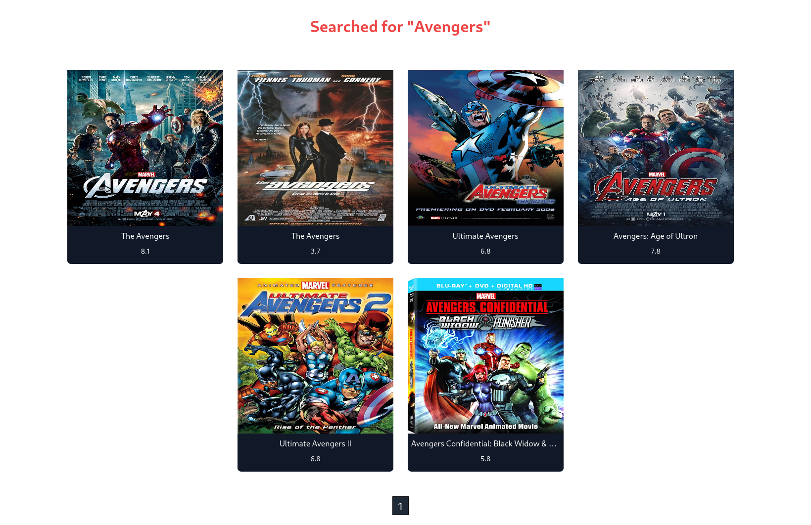

# [TheOdinProject](https://www.theodinproject.com)

## Project: inventory-application

A movie source app inspired by [IMDB](https://www.imdb.com) that any user can edit data but only authoritative user can delete said data.

Using [Tailwind JIT CDN](https://github.com/beyondcode/tailwindcss-jit-cdn) to write All CSS

Almost fully responsive (Still has some clunky UI especially when doing PUT request)

## Features

- Serverside rendering
- Search functionality
- Query by movie tags
- CRUD

## Installation

This app uses environment variables and is not meant to be installed. Please visit the demo site or view source code to know more about details.

## Demo

[Live Demo](https://incb-11.herokuapp.com/)
